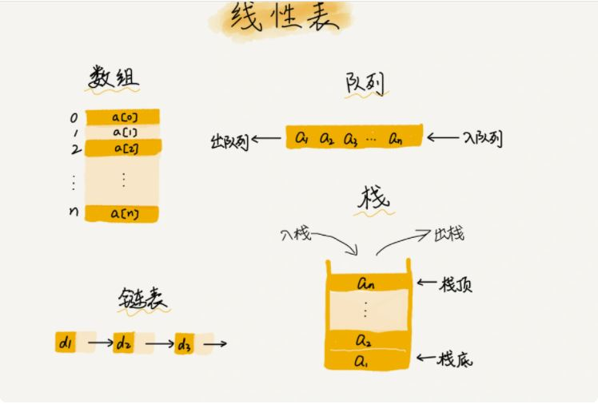
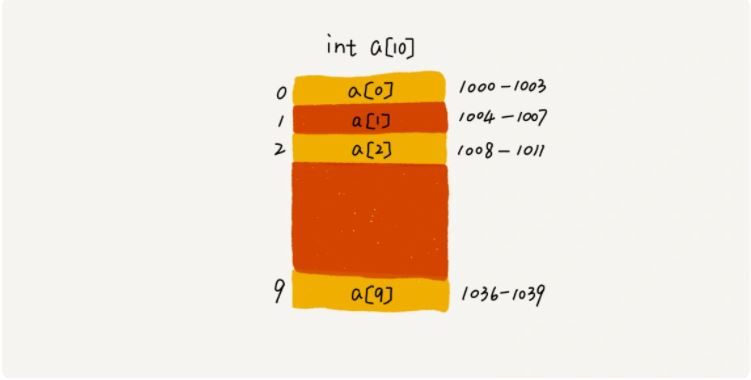
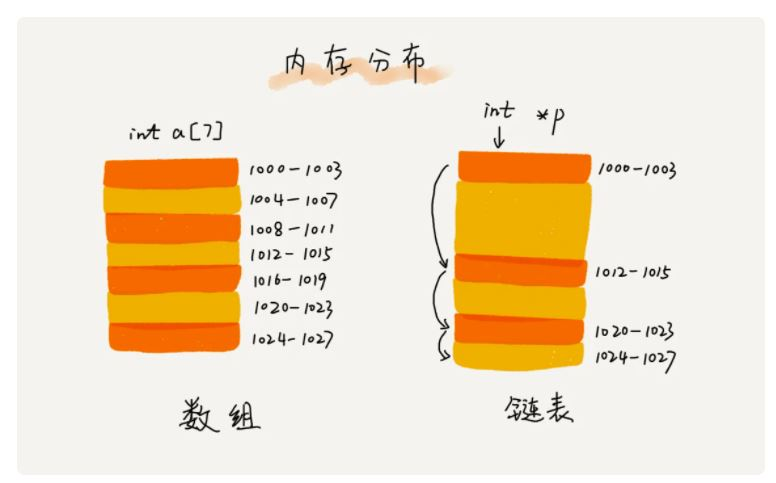

# 数组

数组（Array）是一种线性表数据结构。它用一组连续的内存空间，来存储一组具有相同类型的数据。

第一是线性表（Linear List）。顾名思义，线性表就是数据排成像一条线一样的结构。每个线性表上的数据最多只有前和后两个方向。

第二个是连续的内存空间和相同类型的数据。正是因为这两个限制，它才有了一个堪称“杀手锏”的特性：“随机访问”。要想在数组中删除、插入一个数据，为了保证连续性，就需要做大量的数据搬移工作。

# 链表

链表和数组恰恰相反，它并不需要一块连续的内存空间，它通过“指针”将一组零散的内存块串联起来使用

