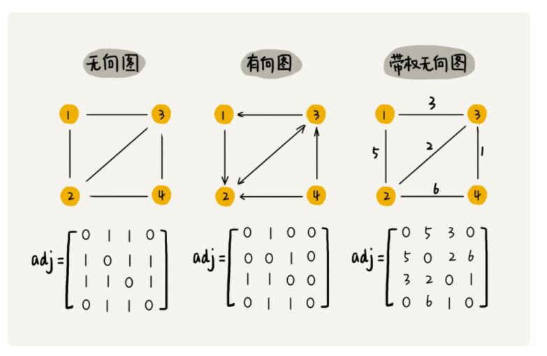

# 数组

数组（Array）是一种线性表数据结构。它用一组连续的内存空间，来存储一组具有相同类型的数据。

第一是线性表（Linear List）。顾名思义，线性表就是数据排成像一条线一样的结构。每个线性表上的数据最多只有前和后两个方向。

第二个是连续的内存空间和相同类型的数据。正是因为这两个限制，它才有了一个堪称“杀手锏”的特性：“随机访问”。要想在数组中删除、插入一个数据，为了保证连续性，就需要做大量的数据搬移工作。

# 链表

链表和数组恰恰相反，它并不需要一块连续的内存空间，它通过“指针”将一组零散的内存块串联起来使用

# 栈
在一端插入和删除数据，并且满足后进先出、先进后出的特性

栈既可以用数组来实现，也可以用链表来实现。用数组实现的栈，我们叫作顺序栈，用链表实现的栈，我们叫作链式栈。

# 队列
队列跟栈非常相似，支持的操作也很有限，最基本的操作也是两个：入队 enqueue()，放一个数据到队列尾部；出队 dequeue()，从队列头部取一个元素。

跟栈一样，队列可以用数组来实现，也可以用链表来实现。用数组实现的栈叫作顺序栈，用链表实现的栈叫作链式栈。同样，用数组实现的队列叫作顺序队列，用链表实现的队列叫作链式队列。

用数组来实现队列的时候，在 tail==n 时，会有数据搬移操作，这样入队操作性能就会受到影响。循环队列，顾名思义，它长得像一个环。原本数组是有头有尾的，是一条直线。现在我们把首尾相连，扳成了一个环。

# 树

多叉树这里先不涉及如B+树等

二叉树，顾名思义，每个节点最多有两个“叉”，也就是两个子节点，分别是左子节点和右子节点。

叶子节点全都在最底层，除了叶子节点之外，每个节点都有左右两个子节点，这种二叉树就叫做满二叉树。

叶子节点都在最底下两层，最后一层的叶子节点都靠左排列，并且除了最后一层，其他层的节点个数都要达到最大，这种二叉树叫做完全二叉树。

二叉查找树（Binary Search Tree）

二叉查找树要求，在树中的任意一个节点，其左子树中的每个节点的值，都要小于这个节点的值，而右子树节点的值都大于这个节点的值

在二叉查找树中，查找、插入、删除等很多操作的时间复杂度都跟树的高度成正比。两个极端情况的时间复杂度分别是 O(n) 和 O(logn)，分别对应二叉树退化成链表的情况和完全二叉树。

平衡二叉查找树

平衡二叉查找树中“平衡”的意思，其实就是让整棵树左右看起来比较“对称”、比较“平衡”，不要出现左子树很高、右子树很矮的情况。这样就能让整棵树的高度相对来说低一些，相应的插入、删除、查找等操作的效率高一些。

AVL 树:二叉树中任意一个节点的左右子树的高度相差不能大于 1,是一种高度平衡的二叉查找树,还满足二叉查找树的特点.

红黑树:从根节点到各个叶子节点的最长路径，有可能会比最短路径大一倍。

红黑树中的节点，一类被标记为黑色，一类被标记为红色。除此之外，一棵红黑树还需要满足这样几个要求：

1. 根节点是黑色的
2. 每个叶子节点都是黑色的空节点（NIL），也就是说，叶子节点不存储数据；
3. 任何相邻的节点都不能同时为红色，也就是说，红色节点是被黑色节点隔开的；
4. 每个节点，从该节点到达其可达叶子节点的所有路径，都包含相同数目的黑色节点；

# 图

图中的元素我们就叫做顶点（vertex）。图中的一个顶点可以与任意其他顶点建立连接关系。我们把这种建立的关系叫做边（edge）。

顶点相连接的边的条数叫做顶点的度（degree）.在有向图中，我们把度分为入度（In-degree）和出度（Out-degree）。顶点的入度，表示有多少条边指向这个顶点；顶点的出度，表示有多少条边是以这个顶点为起点指向其他顶点。对应到微博的例子，入度就表示有多少粉丝，出度就表示关注了多少人。

带权图（weighted graph）在带权图中，每条边都有一个权重（weight），我们可以通过这个权重来表示 QQ 好友间的亲密度。

存储方式:

1. 邻接矩阵

  
2. 邻接表和逆邻接表

图的搜索算法:深度优先搜索算法和广度优先搜索算法

广度优先搜索（BFS）:
是一种“地毯式”层层推进的搜索策略，即先查找离起始顶点最近的，然后是次近的，依次往外搜索。

深度优先搜索（DFS）:
假设你站在迷宫的某个岔路口，然后想找到出口。你随意选择一个岔路口来走，走着走着发现走不通的时候，你就回退到上一个岔路口，重新选择一条路继续走，直到最终找到出口。这种走法就是一种深度优先搜索策略。
